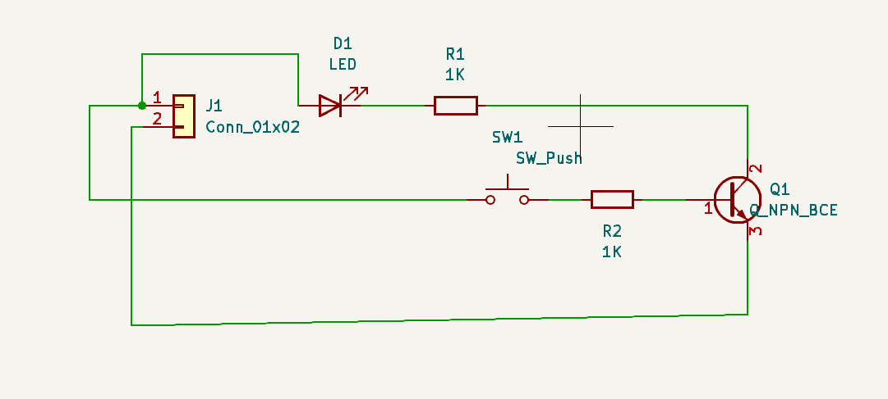

# Transistor-Control-PCB

 Transistor LED Control PCB (KiCad)

## Description

This project demonstrates how to control an LED using an NPN transistor as a switch.

##  Components

* NPN Transistor (BC547 / 2N2222)
* LED
* Resistors (1k)
* Push Button
* Connector

##  Concept

A transistor is used as a switch:

* Button provides base signal
* Transistor turns ON
* LED glows

##  Output

### Schematic

### PCB Layout

### 3D View

##  Tool

KiCad
